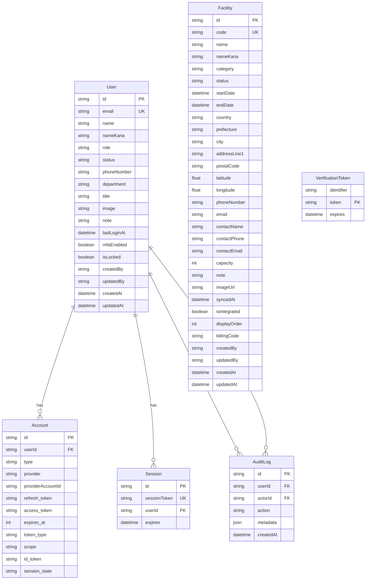

# データモデル定義書

## 1. ER 図（論理レベル）

> 備考: User と Facility は現段階では直接的なリレーションはない。将来的に施設担当者などで結合する場合は中間テーブルを追加検討する。

## 2. テーブル定義（Prisma スキーマ準拠）

### 2.1. `User`

| 列名 | 型 | Not Null | 既定値 | 説明 |
| --- | --- | --- | --- | --- |
| id | `UUID` | ✅ | `uuid_generate_v4()` | 主キー |
| email | `TEXT` | ✅ | | 一意制約。ログイン ID |
| name | `TEXT` | ✅ | | 表示名 |
| nameKana | `TEXT` |  | | フリガナ |
| role | `Role` | ✅ | `USER` | `ADMIN` / `MANAGER` / `USER` |
| status | `UserStatus` | ✅ | `INVITED` | `ACTIVE` / `INVITED` / `DISABLED` |
| phoneNumber | `TEXT` |  | | 代表電話 |
| department | `TEXT` |  | | 所属部署 |
| title | `TEXT` |  | | 役職 |
| image | `TEXT` |  | | プロフィール画像 URL |
| note | `TEXT` |  | | 備考 |
| lastLoginAt | `TIMESTAMP` |  | | 最終ログイン日時 |
| mfaEnabled | `BOOLEAN` | ✅ | `false` | MFA 状態 |
| isLocked | `BOOLEAN` | ✅ | `false` | アカウントロック |
| createdBy | `TEXT` |  | | 登録者 |
| updatedBy | `TEXT` |  | | 更新者 |
| createdAt | `TIMESTAMP` | ✅ | `now()` | 作成日時 |
| updatedAt | `TIMESTAMP` | ✅ | `CURRENT_TIMESTAMP` (自動更新) | 更新日時 |

インデックス: `email` (unique)

### 2.2. `Facility`

| 列名 | 型 | Not Null | 既定値 | 説明 |
| --- | --- | --- | --- | --- |
| id | `UUID` | ✅ | `uuid_generate_v4()` | 主キー |
| code | `TEXT` | ✅ | | 一意な施設コード |
| name | `TEXT` | ✅ | | 施設名称 |
| nameKana | `TEXT` |  | | フリガナ |
| category | `FacilityCategory` | ✅ | | `HEAD` / `BRANCH` / `WAREHOUSE` / `STORE` / `OTHER` |
| status | `FacilityStatus` | ✅ | `ACTIVE` | 稼働状況 |
| startDate | `TIMESTAMP` |  | | 稼働開始日 |
| endDate | `TIMESTAMP` |  | | 稼働終了日 |
| country | `TEXT` |  | `"JP"` | 国コード |
| prefecture | `TEXT` |  | | 都道府県 |
| city | `TEXT` |  | | 市区町村 |
| addressLine1 | `TEXT` |  | | 住所詳細 |
| postalCode | `TEXT` |  | | 郵便番号 |
| latitude | `DOUBLE` |  | | 緯度 |
| longitude | `DOUBLE` |  | | 経度 |
| phoneNumber | `TEXT` |  | | 代表電話 |
| email | `TEXT` |  | | 代表メール |
| contactName | `TEXT` |  | | 担当者氏名 |
| contactPhone | `TEXT` |  | | 担当者電話 |
| contactEmail | `TEXT` |  | | 担当者メール |
| capacity | `INTEGER` |  | | 収容人数 |
| note | `TEXT` |  | | 備考 |
| imageUrl | `TEXT` |  | | 施設画像 URL |
| syncedAt | `TIMESTAMP` |  | | 外部連携最終日時 |
| createdBy | `TEXT` |  | | 登録者 |
| updatedBy | `TEXT` |  | | 更新者 |
| isIntegrated | `BOOLEAN` | ✅ | `false` | 外部連携済みフラグ |
| displayOrder | `INTEGER` |  | | 表示順 |
| billingCode | `TEXT` |  | | 支払先コード |
| createdAt | `TIMESTAMP` | ✅ | `now()` | 作成日時 |
| updatedAt | `TIMESTAMP` | ✅ | `CURRENT_TIMESTAMP` | 更新日時 |

インデックス: `code` (unique), 並び順は `displayOrder` → `code` で採用

### 2.3. `AuditLog`

| 列名 | 型 | Not Null | 既定値 | 説明 |
| --- | --- | --- | --- | --- |
| id | `UUID` | ✅ | `uuid_generate_v4()` | 主キー |
| userId | `UUID` |  | | 対象ユーザー（削除時 `CASCADE`） |
| actorId | `UUID` |  | | 実行者（削除時 `SET NULL`） |
| action | `TEXT` | ✅ | | 操作内容 |
| metadata | `JSONB` |  | | 追加情報 |
| createdAt | `TIMESTAMP` | ✅ | `now()` | 作成日時 |

外部キー: `userId -> User.id`, `actorId -> User.id`

### 2.4. NextAuth 関連テーブル

- `Account`: OAuth プロバイダ情報。`provider + providerAccountId` でユニーク。
- `Session`: セッショントークン管理。
- `VerificationToken`: メール確認やパスワードレスログインに使用。

これらは NextAuth の標準スキーマに準拠しており、User と `userId` 外部キーで紐付く。

## 3. 今後の拡張
- 施設とユーザーを関連付ける中間テーブル（施設担当者等）の追加。
- 履歴管理テーブル（FacilityHistory など）で変更ログを保持。
- 住所正規化・GIS 連携（別テーブルまたはビュー）による検索機能の強化。
- `syncedAt` と外部連携ステータスの詳細を管理するテーブルの追加検討。
